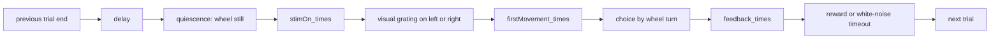
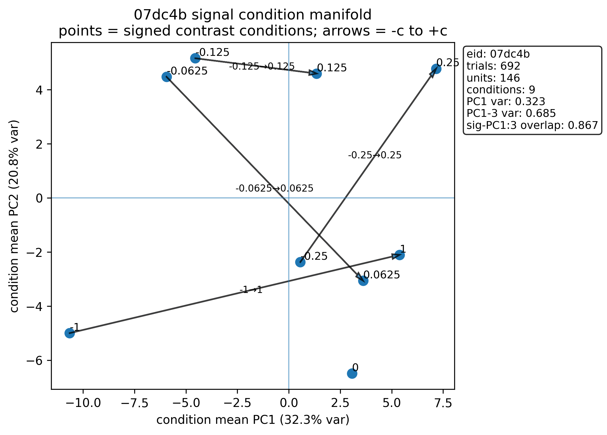
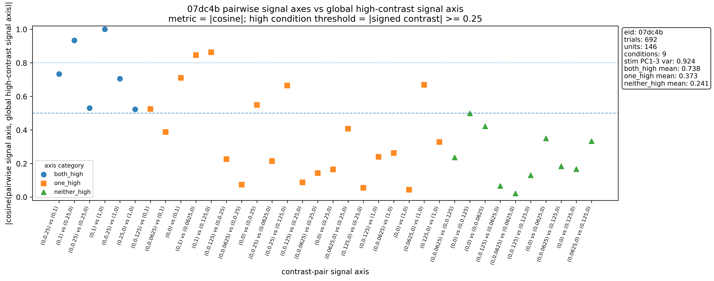
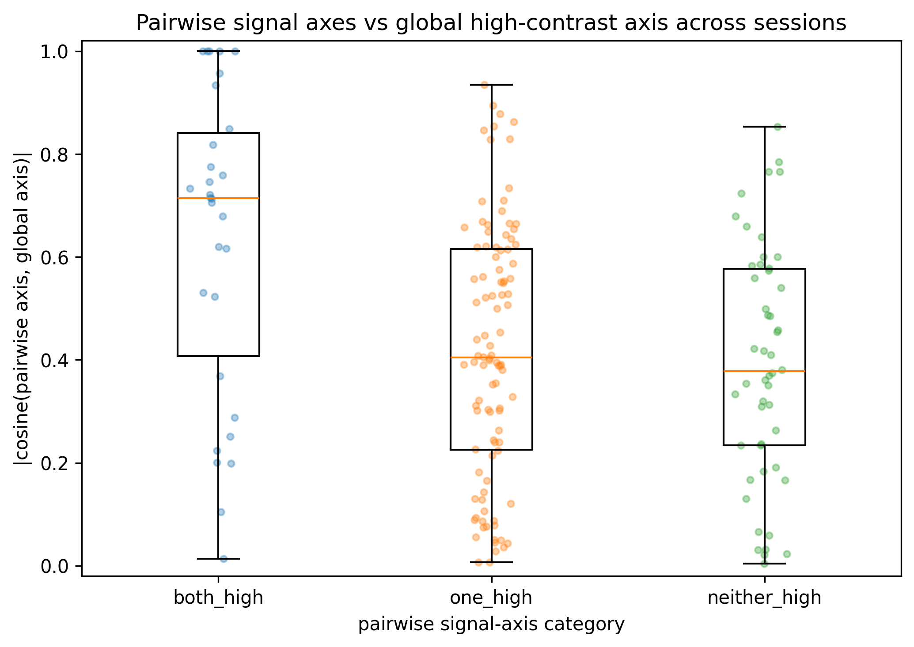
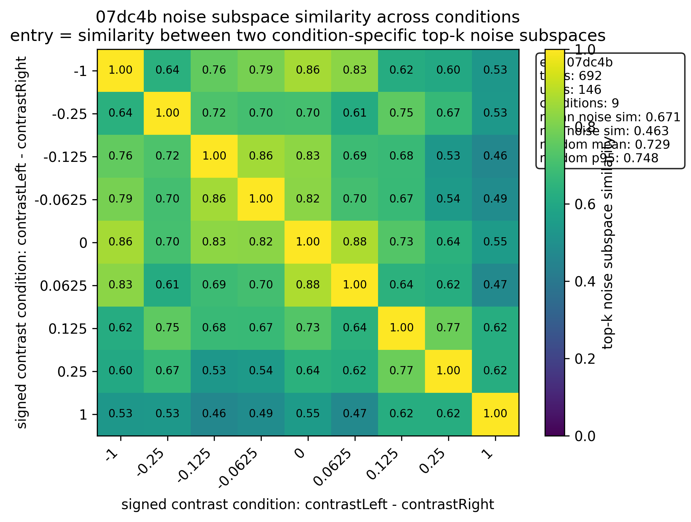
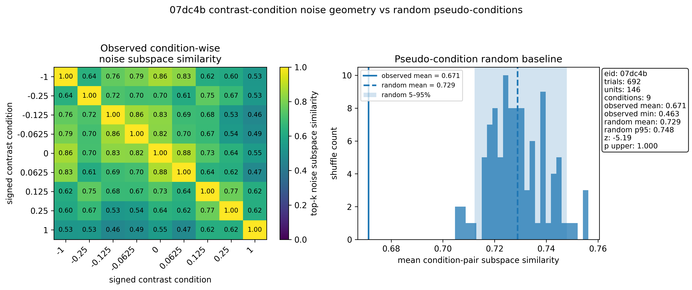
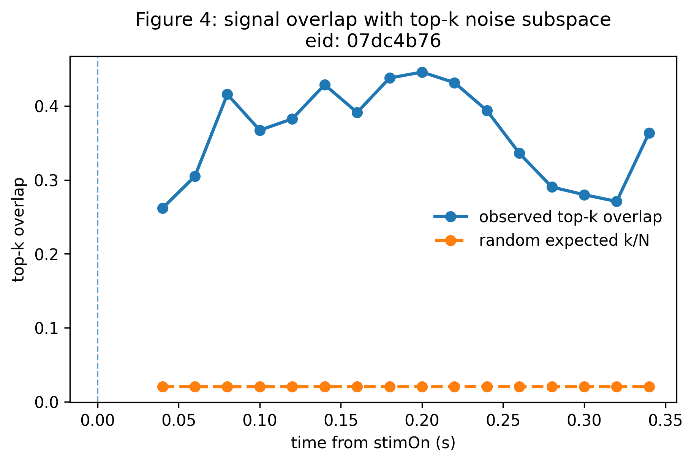
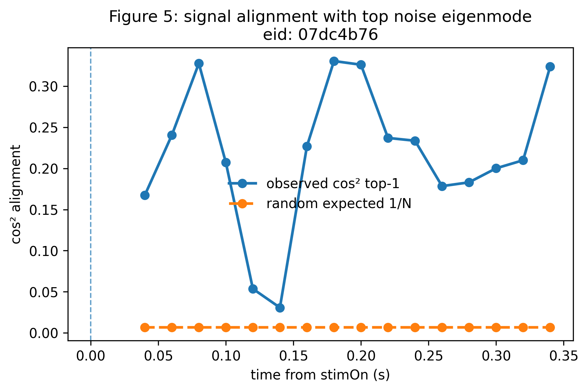

# Signal-Noise Alignment in IBL Brain-Wide Map VISp Data

This repository analyzes whether stimulus-coding directions in VISp population activity are aligned with dominant trial-to-trial residual variability in International Brain Laboratory (IBL) Brain-Wide Map Neuropixels recordings.

The working question is:

> Do visual stimulus signal vectors lie inside the dominant noise subspace, or are they geometrically separated from it?

The current code focuses on VISp units during the IBL visual decision-making task. It implements data access through `one.api`, session and insertion selection, trial parsing, firing-rate construction, condition geometry, and time-resolved signal/noise alignment.

## Dataset and Paper Context

This project uses the public IBL Brain-Wide Map (BWM) dataset:

> International Brain Laboratory. **A brain-wide map of neural activity during complex behaviour.** *Nature* (2025). https://www.nature.com/articles/s41586-025-09235-0

The BWM paper reports Neuropixels recordings from mice performing a standardized visual decision-making task. The paper's main stimulus analyses compare left versus right visual stimuli, often in stimulus-aligned windows such as 0-100 ms after stimulus onset. This repository asks a related but more geometric question: how the stimulus mean-difference vector relates to the dominant residual/noise covariance modes in VISp.

Useful links:

- BWM paper: https://www.nature.com/articles/s41586-025-09235-0
- IBL Brain-Wide Map page: https://www.internationalbrainlab.com/brainwide-map
- ONE quick start: https://docs.internationalbrainlab.org/notebooks_external/one_quickstart.html
- IBL loading examples: https://docs.internationalbrainlab.org/loading_examples.html

## Experimental Task

The recordings come from the IBL visual decision-making task. Each mouse is head-fixed in front of a screen and controls a wheel with its front paws.

On each trial:

1. A visual stimulus appears on the left or right side of the screen.
2. The mouse turns the wheel to move the stimulus to the center.
3. The response window is free, up to 60 s after stimulus onset.
4. Correct trials receive water reward.
5. Incorrect trials receive a white-noise pulse and a 2 s timeout.
6. The next trial begins after a delay and a quiescence period, during which the wheel must be held still.

The stimulus is a peripheral visual grating. Stimulus contrast is sampled from five levels in the BWM task: 100%, 25%, 12.5%, 6.25%, and 0%. On 0% contrast trials, no visual stimulus is visible, but the trial is still assigned a correct side according to the current block statistics.

The task starts with 90 unbiased trials, where the left and right stimulus probabilities are equal. After that, trials occur in biased blocks. In right-bias blocks, stimuli appear on the right on 80% of trials; in left-bias blocks, stimuli appear on the right on 20% of trials. Block changes are not explicitly cued.

### Trial Timeline

This README distinguishes the full behavioral trial from the analysis windows used in this repository.



Key ALF trial fields:

```text
stimOn_times          stimulus onset
stimOff_times         stimulus offset
contrastLeft          left stimulus contrast, NaN if no left stimulus
contrastRight         right stimulus contrast, NaN if no right stimulus
choice                animal's wheel-turn choice
feedbackType          reward or non-reward
feedback_times        feedback onset
firstMovement_times   first detected wheel movement
probabilityLeft       current block prior
intervals             trial start and end interval
```

The BWM paper excludes trials from its main analyses when required events cannot be detected, and excludes trials with first wheel-movement time outside 0.08-2.00 s. This repository currently filters only for finite `stimOn_times` and `stimOff_times` inside `src/ibl_io.py`; stricter behavioral exclusion can be added if the analysis needs closer matching to the paper.

## Repository Analysis Windows

The repository currently uses two stimulus-aligned response definitions.

### Static stimulus-window response

Used by `scripts/run_condition_geometry.py`:

```text
interval_i = [stimOn_times_i, stimOff_times_i]
X_i,n = spike_count(unit n in interval_i) / duration(interval_i)
X shape = n_trials x n_units
```

This static matrix is used for condition-mean geometry across signed contrast values.

### Time-binned stimulus response

Used by `scripts/run_timebinned_alignment.py`:

```text
window_b = [stimOn_times + bin_start_b, stimOn_times + bin_end_b]
X_i,b,n = spike_count(unit n in window_b) / bin_size
X shape = n_trials x n_bins x n_units
```

Default parameters:

```text
t_start = 0.0 s
t_end = 0.4 s
bin_size = 0.08 s
step_size = 0.02 s
k = 3 noise dimensions
```

This makes alignment curves from stimulus onset through the first 400 ms after stimulus onset.

## Using ONE API

The repository uses OpenAlyx through `one.api`.

```python
from one.api import ONE

ONE.setup(
    base_url="https://openalyx.internationalbrainlab.org",
    silent=True,
)

one = ONE(
    base_url="https://openalyx.internationalbrainlab.org",
    password="international",
    cache_dir="/scratch/midway3/xiaorantu/ONE",
)
```

The helper used by the scripts is:

```python
import src.ibl_io as ibl_io

one = ibl_io.one_setup(cache_dir="/scratch/midway3/xiaorantu/ONE")
```

The cache directory should be on scratch or another large local storage location because spike-sorting files are large.

Typical loading flow:

```python
from iblatlas.atlas import AllenAtlas
import src.ibl_io as ibl_io

atlas = AllenAtlas()
eids = ibl_io.build_eids_from_results("results/VISp_subjects_by_lab.json")
eid = eids[0]

trials = ibl_io.load_trials(one, eid)
pid = ibl_io.pick_best_insertion(one, atlas, eid, target_prefix="VISp")
spikes, clusters = ibl_io.load_spikes_and_clusters(one, atlas, pid)
region_cluster_ids = ibl_io.get_region_cluster_ids(clusters, target_prefix="VISp")
```

## Repository Structure

```text
IBL-Signal_Noise_Alignment/
  README.md
  src/
    ibl_io.py              ONE/OpenAlyx loading and VISp insertion selection
    firing_rates.py        static and time-resolved firing-rate matrices
    trial_selection.py     signed contrast and condition masks
    alignment_metrics.py   signal axes, residual covariance, subspace metrics
    null_model.py          pre-first-stimulus baseline helpers
    time_bin.py            generic time-binned metric runner
  scripts/
    run_condition_geometry.py
    run_timebinned_alignment.py
    check_prestim_recording.py
  figures/
    figure_1/              condition-mean stimulus manifolds
    figure_1_2/            pairwise signal axes vs global signal axis
    figure_2/              condition-specific noise subspace similarities
    figure_3/              noise subspace similarities vs random baseline
    figure_4/              time-binned top-k signal/noise overlap
    figure_5_*/            time-binned top-1 signal/noise alignment
    plot_signal_axis_global_similarity.py
    plot_condition_noise_random_baseline.py
  results/
    VISp_subjects_by_lab.json
    condition_geometry/
    timebinned_alignment/
    pre_first_stim_recording_check.csv
```

## Trial and Condition Definitions

The code defines signed contrast as:

```text
signed_contrast = contrastLeft - contrastRight
```

With this repository's convention:

```text
signed_contrast > 0    left-side visual stimulus
signed_contrast < 0    right-side visual stimulus
signed_contrast = 0    zero-contrast / no visible stimulus
```

Be careful when comparing to papers or plots that use the opposite sign convention. The BWM paper's psychometric signed-contrast convention should not be assumed to match this repository's internal `contrastLeft - contrastRight` convention.

The high-contrast binary signal axis uses:

```text
high_mask = abs(signed_contrast) >= 0.5
pos_mask = high_mask & (signed_contrast > 0)
neg_mask = high_mask & (signed_contrast < 0)
```

The condition-geometry analysis also builds masks for each signed contrast level:

```text
condition c = all trials where signed_contrast == c
```

## Signal/Noise Geometry

For one session or one time bin, let:

```text
X in R^(T x N)
```

where `T` is the number of trials and `N` is the number of selected VISp units.

### Signal Vector

For positive and negative high-contrast stimulus groups:

```text
mu_pos = mean(X_i for positive stimulus trials)
mu_neg = mean(X_i for negative stimulus trials)
Delta_mu = mu_pos - mu_neg
u_sig = Delta_mu / ||Delta_mu||
```

This `u_sig` is the normalized stimulus signal vector.

The condition-geometry pipeline also computes pairwise condition axes:

```text
Delta_mu_(a,b) = mu_a - mu_b
u_(a,b) = Delta_mu_(a,b) / ||Delta_mu_(a,b)||
```

These pairwise axes are compared with the global high-contrast signal axis:

```text
axis_global_similarity_(a,b) = |u_(a,b)^T u_sig|
```

This asks whether local contrast-pair signal directions agree with the global left-versus-right high-contrast signal direction.

### Residual or Noise Covariance

Residuals are computed after subtracting the appropriate condition mean:

```text
R_i = X_i - mu_pos    if trial i is positive
R_i = X_i - mu_neg    if trial i is negative
```

The repository estimates residual covariance with Ledoit-Wolf shrinkage:

```text
C_noise = Cov(R)
C_noise = U Lambda U^T
U_k = [u_1, ..., u_k]
```

### Alignment Metrics

Top-1 alignment:

```text
cosine2_top1 = (u_1^T u_sig)^2
```

Top-k overlap:

```text
overlap_topk = ||U_k^T u_sig||^2
```

For comparison to random orientation:

```text
expected_random_cosine2 = 1 / N
expected_random_overlap = k / N
```

The implementation is in `src/alignment_metrics.py`.

## Current Pipeline

### 1. Condition geometry

Run:

```bash
python scripts/run_condition_geometry.py
```

Outputs:

```text
results/condition_geometry/condition_geometry_summary.csv
results/condition_geometry/condition_geometry_details.pkl
figures/figure_1/*_signal_condition_manifold.png
figures/figure_2/*_noise_condition_similarity.png
```

This analysis asks whether condition means across signed contrasts occupy a low-dimensional stimulus manifold, whether pairwise contrast axes align with the global high-contrast signal axis, and whether condition-specific residual/noise subspaces are similar across stimulus conditions.

Generate the signal-axis/global-axis plots:

```bash
python figures/plot_signal_axis_global_similarity.py \
  --details-pkl results/condition_geometry/condition_geometry_details.pkl \
  --summary-csv results/condition_geometry/condition_geometry_summary.csv \
  --out-dir figures/figure_1_2/signal_axis_vs_global_thresh025 \
  --high-threshold 0.25
```

Generate condition-noise random-baseline plots:

```bash
python figures/plot_condition_noise_random_baseline.py \
  --summary-csv results/condition_geometry/condition_geometry_summary.csv \
  --details-pkl results/condition_geometry/condition_geometry_details.pkl \
  --out-dir figures/figure_3
```

Example current figure:











### 2. Time-binned signal/noise alignment

Run:

```bash
python scripts/run_timebinned_alignment.py \
  --cache-dir /scratch/midway3/xiaorantu/ONE \
  --t-start 0.0 \
  --t-end 0.4 \
  --bin-size 0.08 \
  --step-size 0.02 \
  --k 3 \
  --max-sessions 5
```

Outputs:

```text
results/timebinned_alignment/*_timebinned_alignment_summary.csv
results/timebinned_alignment/*_timebinned_alignment_details.pkl
figures/figure_4/*_figure4_overlap_topk.png
figures/figure_5_1/*_figure5_alignment_top1.png
figures/figure_5_2/*_figure5_alignment_top1.png
figures/figure_5_3/*_figure5_alignment_top1.png
```

Example current figure:





### 3. Pre-first-stimulus recording check

Run:

```bash
python scripts/check_prestim_recording.py
```

Output:

```text
results/pre_first_stim_recording_check.csv
```

This checks how much neural recording exists before the first `stimOn_times` event in the same selected session/insertion. It should be described as a matched pre-first-stimulus baseline check, not as the official IBL passive spontaneous protocol unless passive-period metadata are explicitly loaded for that session.

## Current Results Snapshot

The current checked VISp sessions show that the condition-mean stimulus geometry is low-dimensional. In `results/condition_geometry/condition_geometry_summary.csv`, the first three condition PCs explain about 0.92-0.98 of condition-mean variance across the five current sessions.

The updated condition-geometry outputs also store the global high-contrast signal axis (`u_sig`) and the pairwise signal-axis summaries in `condition_geometry_details.pkl`. The `figure_1_2` plots show how each local contrast-pair axis aligns with the global axis, grouped by whether both, one, or neither condition is high contrast.

The `figure_3` plots compare observed condition-wise noise subspace similarity with a pseudo-condition random baseline. This helps distinguish stable condition-specific noise geometry from similarity expected after randomly partitioning residual trials.

The time-binned alignment outputs summarize:

```text
cosine2_top1       alignment of the signal vector with the dominant noise eigenmode
overlap_topk       signal-vector energy inside the top-k noise subspace
expected_random_*  random-orientation baseline given the number of units
```

These outputs are best interpreted session by session at the current stage. The repository already stores both observed and random-orientation baseline values, so downstream plots can ask whether signal/noise alignment is consistently above chance and whether it changes over the first 400 ms after stimulus onset.

## Notes for Researchers Reusing the Pipeline

Start from `results/VISp_subjects_by_lab.json`, which stores the current VISp session list by lab and subject. The scripts flatten that JSON into eids, choose the insertion with the most units matching `target_prefix`, and then load spikes, clusters, and trials through ONE/OpenAlyx.

The minimum sequence for a new analysis is:

```python
import src.ibl_io as ibl_io
import src.firing_rates as fr
import src.trial_selection as ts
import src.alignment_metrics as am

trials = ibl_io.load_trials(one, eid)
pid = ibl_io.pick_best_insertion(one, atlas, eid, target_prefix="VISp")
spikes, clusters = ibl_io.load_spikes_and_clusters(one, atlas, pid)
region_cluster_ids = ibl_io.get_region_cluster_ids(clusters, target_prefix="VISp")

X, unit_ids = fr.compute_static_firing_rates(
    spikes,
    trials["stimOn_times"],
    trials["stimOff_times"],
    region_cluster_ids,
)
X, unit_mask = fr.filter_active_units(X, min_units=5)

signed_contrast = ts.get_signed_contrast(trials)
metrics = am.signal_noise_alignment(X, signed_contrast, k=3, min_trials=5)
```

For time-resolved analysis, use `compute_time_resolved_firing_rates` and `run_timebinned_metric`, as in `scripts/run_timebinned_alignment.py`.

## Terminology

`Signal vector` means the mean population response difference between two stimulus groups.

`Noise` or `residual covariance` means trial-to-trial covariance after subtracting condition-specific evoked means.

`Noise subspace` means the top eigenvectors of the residual covariance matrix.

`Condition geometry` means geometry of condition-averaged population responses across signed contrast levels.

`Pre-first-stimulus baseline` means activity before the first task stimulus onset in the same recording, not the official passive protocol.

## References

- International Brain Laboratory. **A brain-wide map of neural activity during complex behaviour.** *Nature* (2025). https://www.nature.com/articles/s41586-025-09235-0
- International Brain Laboratory Brain-Wide Map page. https://www.internationalbrainlab.com/brainwide-map
- Findling et al. **Brain-wide representations of prior information in mouse decision-making.** *Nature* (2025). https://www.nature.com/articles/s41586-025-09226-1
- IBL documentation. https://docs.internationalbrainlab.org/
